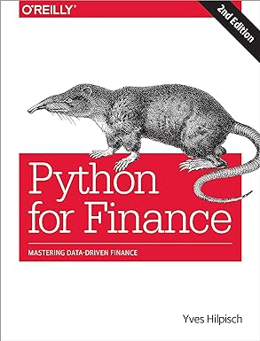

# 📚 Engineering Books I've Read

Welcome to my reading list! Here are some of the engineering books I've read over the years, along with summaries and my
key takeaways from each.

| Book Cover                                                                                                                                                                                                                                                                                                                                                                                                                                                                                                                                                                                              | Title                                                      | Author                                                                                                                    | My Thoughts                                                                                                                                                                                                                                                                                                                                             |
|---------------------------------------------------------------------------------------------------------------------------------------------------------------------------------------------------------------------------------------------------------------------------------------------------------------------------------------------------------------------------------------------------------------------------------------------------------------------------------------------------------------------------------------------------------------------------------------------------------|------------------------------------------------------------|---------------------------------------------------------------------------------------------------------------------------|---------------------------------------------------------------------------------------------------------------------------------------------------------------------------------------------------------------------------------------------------------------------------------------------------------------------------------------------------------|
|                                                                                                                                                                                               | **Python for Finance**                                     | Yves Hilpisch                                                                                                             | Currently reading                                                                                                                                                                                                                                                                                                                                       |
|                                                                                                                                                                                                                                                                                                                                                                                                                                                          | **The Unicorn Project**                                    | Gene Kim                                                                                                                  | Very similar to the The Phoenix project (the core concepts are focused on again). This book is written, from an engineer's perspective this time, making it a must read after reading The Phoenix project. I loved the novel approach once more.                                                                                                        |
|                                                                                                                                                                                                                                                                                                                                                                                                                                                                      | **The Phoenix Project**                                    | Gene Kim, Kevin Behr, George Spafford                                                                                     | I feel this book would have been more valuable to engineers and companies before 2015. The main concepts in this book are still valuable though. The Three Ways, The Four Types Of Work and The Five Ideals are important for any team to know. Written as a novel, it made it easier to understand the concepts and made for an enjoyable read.        |
|                                                                                                                                                                                                                                                                                                                                                                                                                                                                                   | **No Rules Rules: Netflix and the Culture of Reinvention** | Reed Hastings, Erin Meyer                                                                                                 | This book is written from a management perspective and gives a lot of insights on how to manage a software company. It is fascinating to learn how Netflix has grown and how they have managed to keep their culture intact. There is not much value for engineers here, however it is helpful for engineers looks to be Leads or Engineering Managers. |
|                                                                                                                                                                                                                                                                                                                                                                                                                                                                                       | **Docker in Action**                                       | Jeff Nickoloff, Stephen Kuenzli                                                                                           | - TODO                                                                                                                                                                                                                                                                                                                                                  |
|                                                                                                                                                                                                                                                                                                                                                                                                                                                     | **Architecture Patterns with Python**                      | Harry Percival, Bob Gregory                                                                                               | - TODO                                                                                                                                                                                                                                                                                                                                                  |
|                                                                                                                                                                                                                                                                                                                                                                                                                                                                   | **The Tao of Microservices**                               | Richard Rodger                                                                                                            | - TODO                                                                                                                                                                                                                                                                                                                                                  |
|                                                                                                                                                                                                                                                                                                                                                                                                                                                                                     | **Clean Code**                                             | Robert C. Martin                                                                                                          | - TODO                                                                                                                                                                                                                                                                                                                                                  |
|                                                                                                                                                                                                                                                                                                                                                                                                                                                         | **OCR GCSE Computer Science**                              | George Rouse, Lorne Pearcey                                                                                               | - TODO                                                                                                                                                                                                                                                                                                                                                  |
|                                         | **Agile Scrum Handbook**                                   | Nader K. Rad                                                                                                              | - TODO                                                                                                                                                                                                                                                                                                                                                  |
| [](https://www.amazon.com/Beginning-Android-2-Mark-Murphy-ebook/dp/B004VHJIQ0/ref=sr_1_1?crid=2DUG1CVXGCS2J&dib=eyJ2IjoiMSJ9.P1PFLKk7BdBskag_TgeCrqYcDYq5jz0GbImTBqAIoqpjeWrSwRcWXFF2pFqy0fkmrioIUi80ROJN4gHKJTxkr2figkhDL2QCLGAUY4nBpA0azDNFktKnmSKw6BcBmmwE3vZvvFa_CBQ5tLgXk2Djqvq3zm2sOw-1UVOCk_fmSmGu5x1heGZQXBTanx5Jt_Oew2wL1PG9dzQJvNJSGVt_fPmvvooJ7w3gTsHLpW2DyXc.HgHcSomxkmrAtExs2l2nynyU_ooZ3ZoMhJb7yXslm_Y&dib_tag=se&keywords=beginning+android+2&qid=1716239262&s=books&sprefix=beginning+android+2%2Cstripbooks-intl-ship%2C145&sr=1-1) | **Beginning Android**                                      | Mark L. Murphy                                                                                                            | - TODO                                                                                                                                                                                                                                                                                                                                                  |
|                                                                                                                                                                                                                                                                                                                                                                                                                                                                               | **Beginning PHP 5**                                        | Dave W. Mercer, Allan Kent, Steven Nowicki, David Mercer, Wankyu Choi, Clark Morgan, Frank M. Kromann, Elizabeth Naramore | - TODO                                                                                                                                                                                                                                                                                                                                                  |