# 📚 Engineering Books I've Read

Welcome to my reading list! Here are some of the engineering books I've read over the years, along with summaries and my
key takeaways from each.

| Book Cover                                                                                                                                                                                                                                                                                                                                                                                                                                                                                                                                                                                              | Title                                                      | Author                                                                                                                    | Summary                                                                                                                          | My takeaways                                                                                                                                                                            |
|---------------------------------------------------------------------------------------------------------------------------------------------------------------------------------------------------------------------------------------------------------------------------------------------------------------------------------------------------------------------------------------------------------------------------------------------------------------------------------------------------------------------------------------------------------------------------------------------------------|------------------------------------------------------------|---------------------------------------------------------------------------------------------------------------------------|----------------------------------------------------------------------------------------------------------------------------------|-----------------------------------------------------------------------------------------------------------------------------------------------------------------------------------------|
| [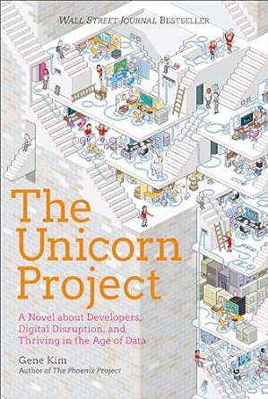](https://www.amazon.co.uk/Unicorn-Project-Disruption-Redshirts-Overthrowing/dp/1942788762)                                                                                                                                                                                                                                                                                                                                                                                                                                                                                | **The Unicorn Project**                                    | Gene Kim                                                                                                                  | A Novel About Developers, Digital Disruption, and Thriving in the Age of Data                                                    | - Currently reading this book                                                                                                                                                           |
| [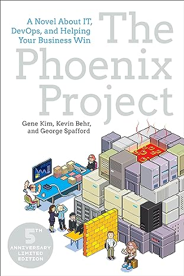](https://www.amazon.com/Phoenix-Project-DevOps-Helping-Business/dp/1942788290)                                                                                                                                                                                                                                                                                                                                                                                                                                                                     | **The Phoenix Project**                                    | Gene Kim, Kevin Behr, George Spafford                                                                                     | A novel about IT and DevOps, demonstrating how to implement effective DevOps practices.                                          | - Collaboration between development and operations teams is key to successful IT management.   - Continuous improvement and automation can significantly enhance productivity.       |
| [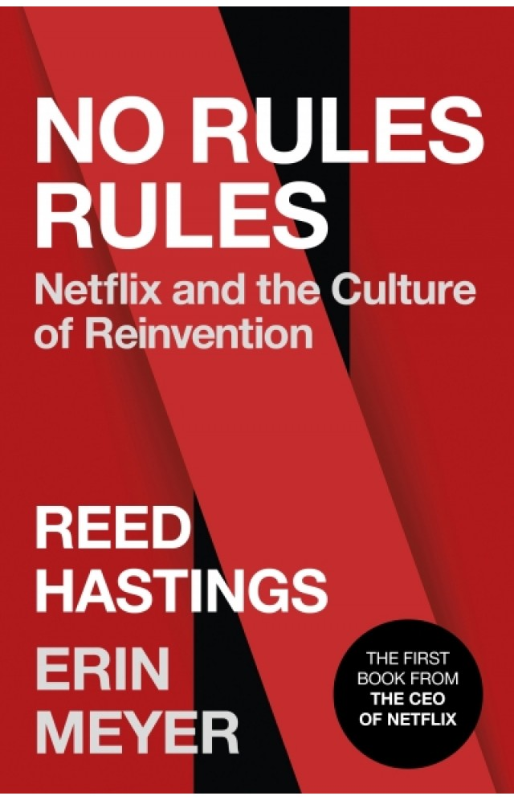](https://www.amazon.com/No-Rules-Netflix-Culture-Reinvention/dp/1984877860)                                                                                                                                                                                                                                                                                                                                                                                                                                                                                  | **No Rules Rules: Netflix and the Culture of Reinvention** | Reed Hastings, Erin Meyer                                                                                                 | A deep dive into the unique and innovative culture at Netflix, emphasizing freedom and responsibility.                           | - The importance of a high-performance culture.   - Balancing freedom and responsibility for employees.   - Encouraging innovation through minimal rules.                         |
| [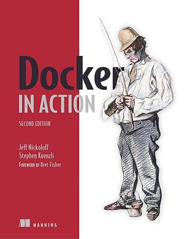](https://www.amazon.com/Docker-Action-Jeff-Nickoloff/dp/1617294764)                                                                                                                                                                                                                                                                                                                                                                                                                                                                                      | **Docker in Action**                                       | Jeff Nickoloff, Stephen Kuenzli                                                                                           | A comprehensive guide to Docker, covering everything from basic concepts to advanced usage and best practices.                   | - Learn the fundamentals of Docker containers and images.   - Understand how to deploy and manage applications using Docker.   - Explore advanced Docker features and techniques. |
| [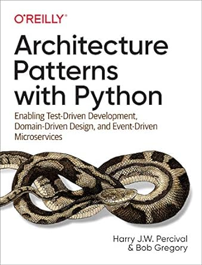](https://www.amazon.com/Docker-Action-Jeff-Nickoloff/dp/1617294764)                                                                                                                                                                                                                                                                                                                                                                                                                                                    | **Architecture Patterns with Python**                      | Harry Percival, Bob Gregory                                                                                               | TODO                                                                                                                             | TODO                                                                                                                                                                                    |
| [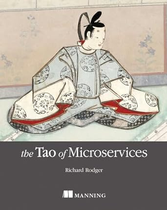](https://www.amazon.com/Tao-Microservices-Richard-Rodger/dp/1617293148)                                                                                                                                                                                                                                                                                                                                                                                                                                                                  | **The Tao of Microservices**                               | Richard Rodger                                                                                                            | Explains the principles and practices of building microservices, focusing on the Taoist philosophy of simplicity and efficiency. | - Principles of designing and building effective microservices.   - Techniques for maintaining simplicity and efficiency in a microservices architecture.                            |
| [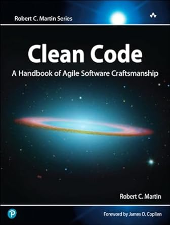](https://www.amazon.com/Clean-Code-Handbook-Software-Craftsmanship/dp/0132350882)                                                                                                                                                                                                                                                                                                                                                                                                                                                                                    | **Clean Code**                                             | Robert C. Martin                                                                                                          | This book emphasizes the importance of writing clean, readable, and maintainable code.                                           | - Write code that is easy to understand and maintain.   - Use meaningful names for variables, functions, and classes.   - Keep functions small and focused on a single task.      |
| [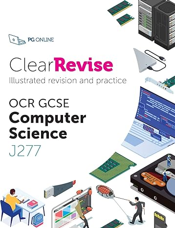](https://www.amazon.co.uk/ClearRevise-GCSE-Computer-Science-J277/dp/1910523232)                                                                                                                                                                                                                                                                                                                                                                                                                                                        | **OCR GCSE Computer Science**                              | George Rouse, Lorne Pearcey                                                                                               | A textbook for GCSE students covering the fundamentals of computer science, aligned with the OCR syllabus.                       | - Understanding basic computer science concepts.   - Preparing for the GCSE Computer Science exam.                                                                                   |
| [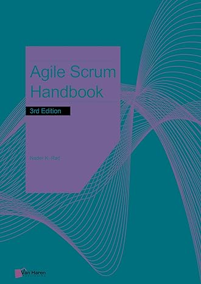](https://www.amazon.co.uk/Agile-Scrum-Handbook-Nader-Rad/dp/9401807590/ref=sr_1_4?crid=134I6X23RRA2W&dib=eyJ2IjoiMSJ9.jfgGzu06VePWaH0FAmOFMGYymt81RrU6EtFtdI8RLGFYjE72qGCtnhrCsGMXdb0JfLo6BxLP8roj-5UNsZx6IDQomZznFtlCk9COwvoK9_HuUJW3ioGGyoI_bbqeb7gMiNky2ARpS0JlZBFe4OJXE3OT47qXEta2nnpKBKmuUDbko4C5z2dkffjcUm1ypEY_H33Uv1czvUTSwtv52PI-k5I9AmBAb3H53-gqVLiUUIA.kYeSFQ4NM34GpZJ051nXBMiK8nGAKtdiTEinHtD8rNw&dib_tag=se&keywords=scrum+handbook&qid=1716239887&sprefix=scrum+handbook%2Caps%2C66&sr=8-4)                                        | **Agile Scrum Handbook**                                   | Nader K. Rad                                                                                                              | TODO                                                                                                                             | TODO                                                                                                                                                                                    |
| [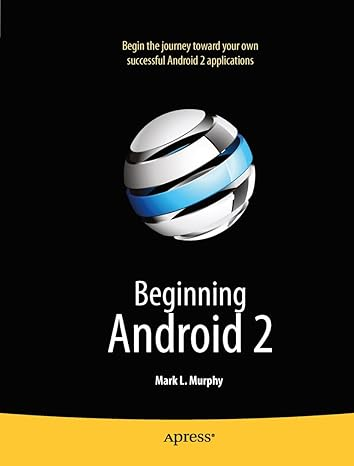](https://www.amazon.com/Beginning-Android-2-Mark-Murphy-ebook/dp/B004VHJIQ0/ref=sr_1_1?crid=2DUG1CVXGCS2J&dib=eyJ2IjoiMSJ9.P1PFLKk7BdBskag_TgeCrqYcDYq5jz0GbImTBqAIoqpjeWrSwRcWXFF2pFqy0fkmrioIUi80ROJN4gHKJTxkr2figkhDL2QCLGAUY4nBpA0azDNFktKnmSKw6BcBmmwE3vZvvFa_CBQ5tLgXk2Djqvq3zm2sOw-1UVOCk_fmSmGu5x1heGZQXBTanx5Jt_Oew2wL1PG9dzQJvNJSGVt_fPmvvooJ7w3gTsHLpW2DyXc.HgHcSomxkmrAtExs2l2nynyU_ooZ3ZoMhJb7yXslm_Y&dib_tag=se&keywords=beginning+android+2&qid=1716239262&s=books&sprefix=beginning+android+2%2Cstripbooks-intl-ship%2C145&sr=1-1) | **Beginning Android**                                      | Mark L. Murphy                                                                                                            | An introduction to Android development, covering the basics of building apps for Android devices.                                | - Get started with Android app development.   - Learn about Android components and architecture.   - Develop and deploy your first Android app.                                   |
| [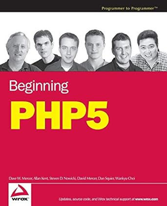](https://www.amazon.co.uk/Beginning-PHP5-Programmer-Allan-Kent/dp/0764557831)                                                                                                                                                                                                                                                                                                                                                                                                                                                                              | **Beginning PHP 5**                                        | Dave W. Mercer, Allan Kent, Steven Nowicki, David Mercer, Wankyu Choi, Clark Morgan, Frank M. Kromann, Elizabeth Naramore | A comprehensive guide to PHP 5, covering everything from basic syntax to building dynamic web applications.                      | - Learn the basics of PHP programming.   - Develop dynamic web applications using PHP and MySQL.   - Understand advanced PHP features and best practices.                         |